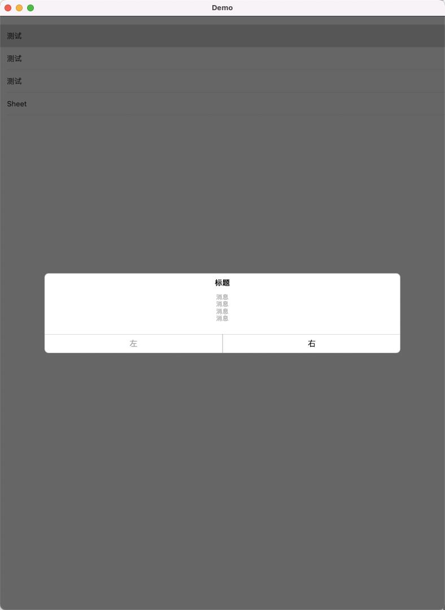
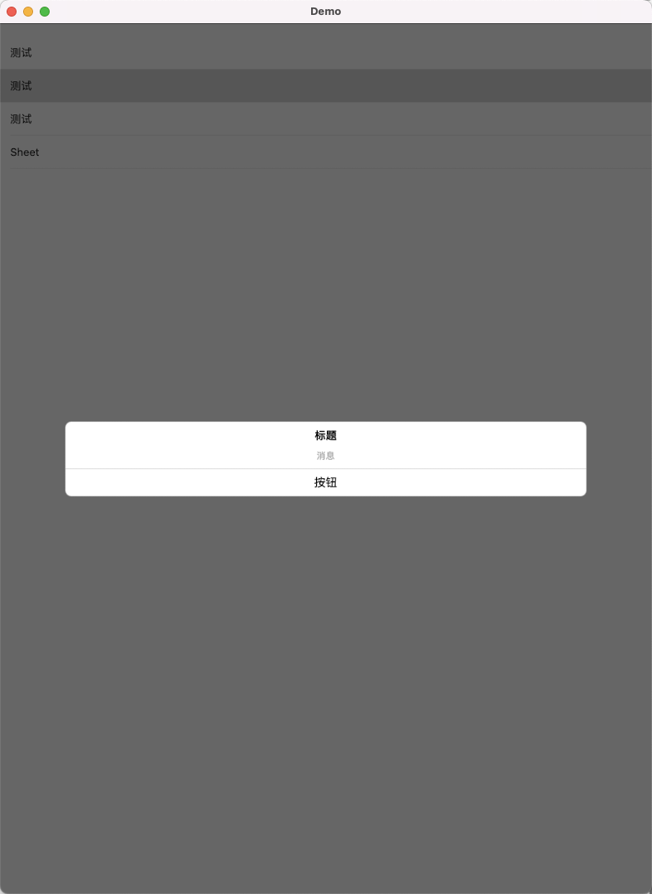
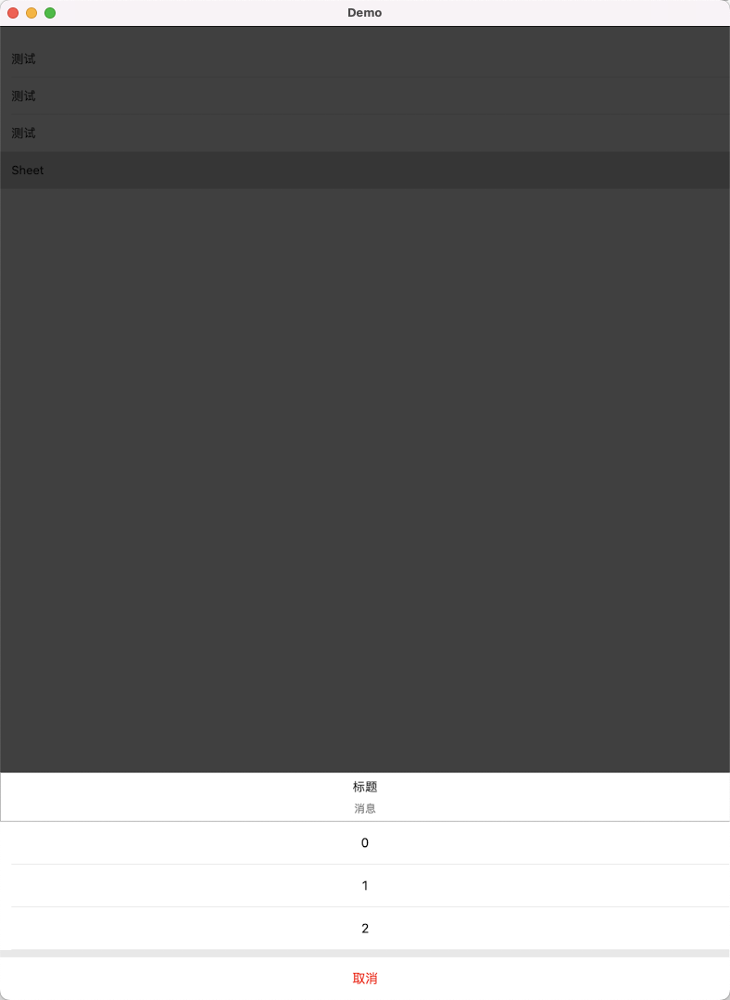

# XQAlert

自定义一些弹框的封装


# 导入

```
pod 'XQAlert', :git => 'https://github.com/888NotFound/XQAlert'
```

# 使用



```
            XQAlertView.show("标题", message: "消息\n消息\n消息\n消息\n", rightBtnTitle: "右", leftBtnTitle: "左") {
                print("点击右")
            } leftCallback: {
                print("点击左")
            }
```



```
            XQAlertView.show("标题", message: "消息", btnTitle: "按钮") {
                print("点击")
            }
```




```
            XQCustomSheetAlertView.sheet(withTitle: "标题", message: "消息", dataArr: ["0", "1", "2"], cancelText: "取消") { index in
                print("点击: \(index)")
            } cancelCallback: { index in
                print("点击取消")
            }
```

